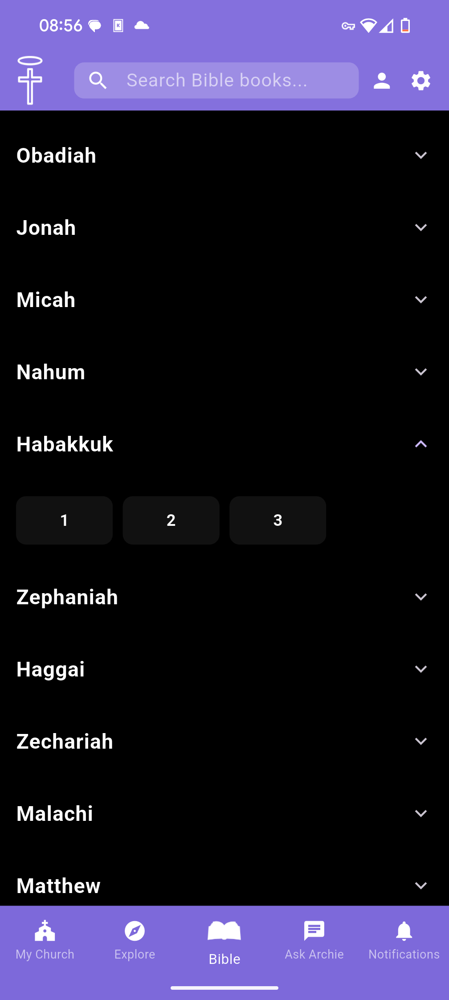
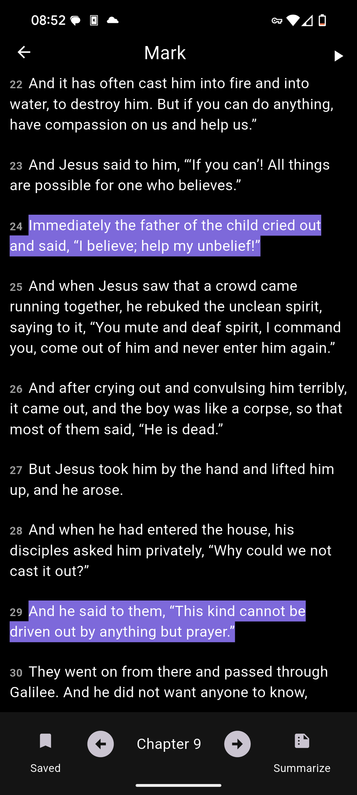
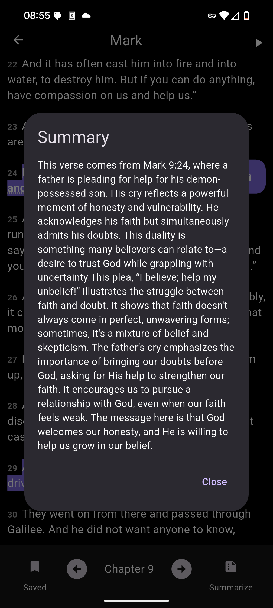
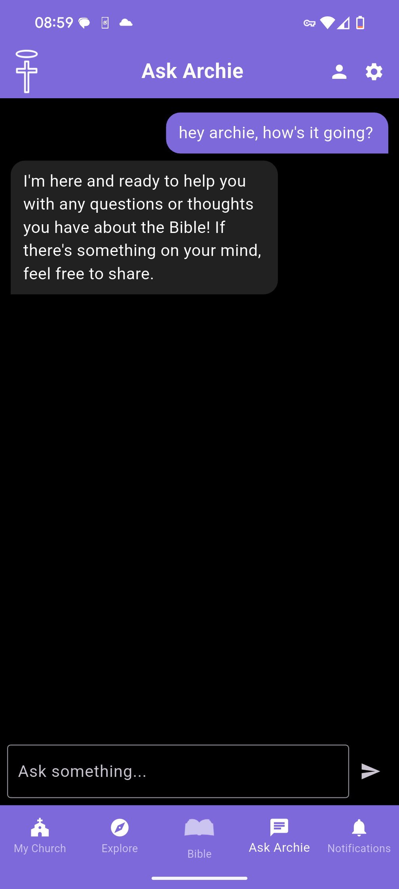
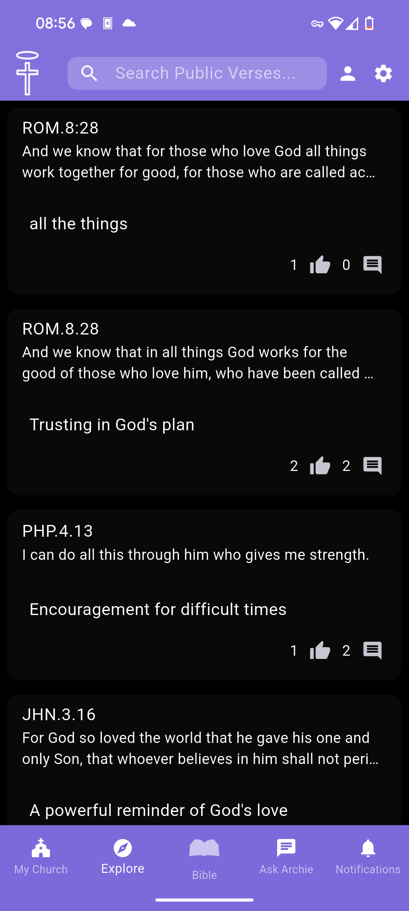
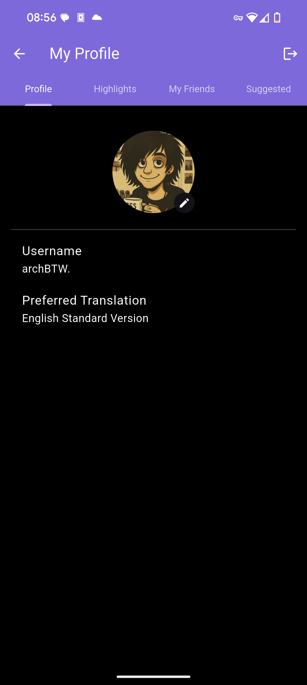
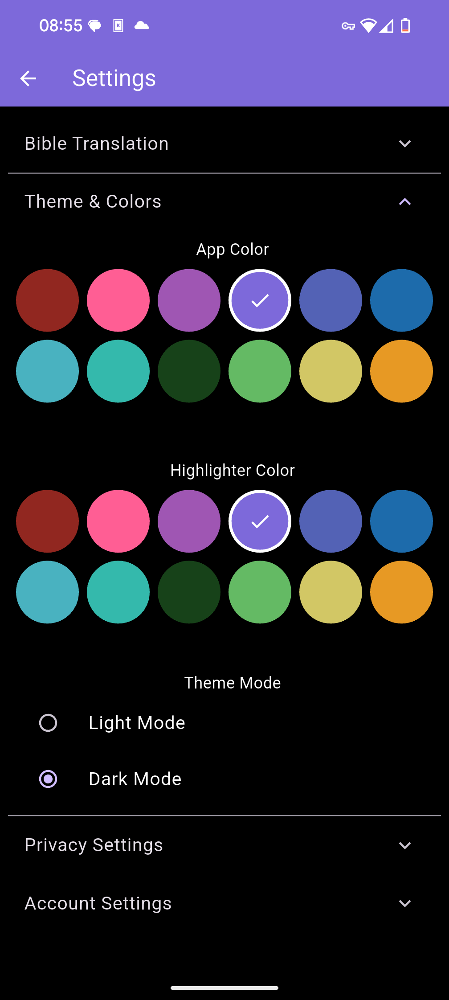

# 📖 bybl – AI-powered. Community-driven. Christ-centered.

**bybl** is a Scripture-focused Bible app designed for individuals and churches. It offers a simple, flexible way to read the Bible, reflect on verses, engage with friends, and explore tools like AI summaries and church announcements. Bybl is built for readers who want a quiet, meaningful, and smart experience with God’s Word.

## ✨ Features

- 📖 **Bible Reader**
  - Multiple Bible translations through API.Bible and Crossway
  - Highlight and save verses
  - Verse/chapter summaries powered by AI
  - Multi-lingual Bible text-to-speech

- 🤖 **Bible Study with Archie**
 
- 🛐 **Church Tools**
  - Join or create churches
  - View and post announcements, events, and prayer requests
  - Participate in small groups and discussion threads

- 🧑‍🤝‍🧑 **Social Features**
  - Friend other users
  - View friends’ shared highlights and notes
  - Profiles with optional picture and privacy controls

- ⚙️ **Settings & Accessibility**
  - Light/dark mode and custom color themes
  - Reader-friendly mode for screen readers
  - Translation search with fuzzy autocomplete

## 🖼️ Screenshots








## 🚀 Getting Started

### Prerequisites
- Flutter
- Go
- [Docker](https://www.docker.com/)
- [Docker Compose](https://docs.docker.com/compose/)
- API keys for:
  - API.Bible
  - OpenAI
  - Wasabi (or S3-compatible storage)
  - Resend (email delivery)

### Local Setup

1. Clone the repository:

```bash
git clone https://github.com/yourusername/bybl.git
cd bybl
```

2. Create a `.env` file for Docker Compose:

```env
# Backend API settings
OPENAI_API_KEY=your_openai_key
API_BIBLE_KEY=your_api_bible_key
ESV_API_KEY=your_optional_esv_key

# PostgreSQL
POSTGRES_DB=bybl
POSTGRES_USER=postgres
POSTGRES_PASSWORD=securepassword

# Wasabi/S3 (for profile images)
S3_ACCESS_KEY=your_wasabi_or_s3_access_key
S3_SECRET_KEY=your_wasabi_or_s3_secret_key
S3_REGION=us-east-1
S3_BUCKET_NAME=bybl-images
S3_ENDPOINT=https://s3.wasabisys.com

# Email (via Resend)
RESEND_API_KEY=your_resend_key
RESEND_FROM_EMAIL=notify@bybl.dev
```

3. Start the app:

```bash
docker-compose up --build
```

The API will be available at `http://localhost:8080`, and the Flutter web client (if included) will be served through NGINX.

### Flutter Mobile

To run the Flutter app on Android or iOS:

```bash
flutter pub get
flutter run
```

Ensure your Flutter app is configured to point to your local or deployed backend URL.

## 📲 Beta Testing

You can request access to the closed beta by emailing billy@billyrigdon.dev.

## 🔧 Built with Flutter and Go


## 🔒 Privacy & Licensing

- Verse notes and profiles are private by default
- Some translations require licensing through API.Bible or the publishers directly
- ESV API includes a free tier (5,000 queries/day); higher tiers may be negotiated separately

## 🙏 Acknowledgements

- [API.Bible](https://scripture.api.bible/)
- [Crossway ESV API](https://api.esv.org/)
- [Wasabi](https://wasabi.com/)
- [Resend](https://resend.com/)
- [OpenAI](https://openai.com/)
- [Flutter](https://flutter.dev/)

## 📬 Contact

Questions, ideas, or want to get involved?

- Email: [billy@billyrigdon.dev](mailto:billy@billyrigdon.dev)

---

> _“Your word is a lamp to my feet and a light to my path.” – Psalm 119:105_
